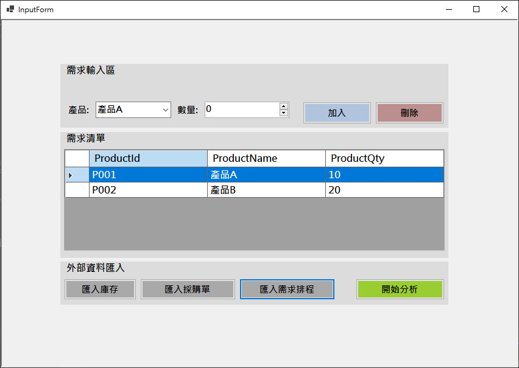
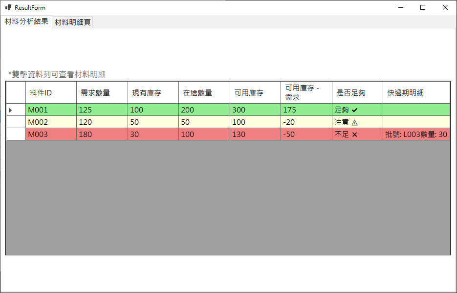
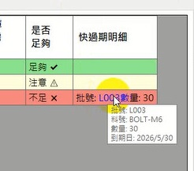
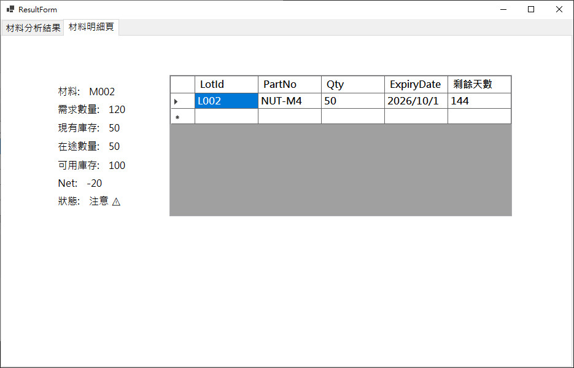

# 📦 Material Availability Checker

一個用於提升工作效率的小工具，協助使用者快速判斷產品所需材料是否足夠，並整合庫存與採購資訊進行分析。

---

## 🔧 功能 Features

+ 手動輸入產品需求
+ 匯入需求排程（Excel）
+ 自動展開 BOM（產品 → 材料）
+ 計算材料需求總量
+ 整合：
  - 現有庫存（Inventory）
  - 在途採購（Purchase Orders）
+ 判斷材料狀態：
  - ✅ 足夠
  - ⚠️ 注意
  - ❌ 不足
+ 顯示「快過期材料」
  - 表格顯示摘要（LotId:Qty）
  - Tooltip 顯示完整資訊（批號、料號、數量、到期日）

---

## 🧠 系統邏輯（核心）

### 1. Input（需求與資料來源）



+ 簡單說明：
    使用者可透過手動輸入或匯入需求排程，並搭配庫存與採購資料進行材料分析。

+ 範例：
```text
    產品 P001 × 10
```
+ 資料來源：
  - 手動輸入：
    1. 產品（Product）
    2. 數量（Qty）
  - Excel 匯入：
    1. 現有庫存（InventoryLots）
    2. 採購單（PurchaseOrders）
+ 重點：

    將分散資料整合為後續計算基礎
    支援手動 + 匯入，提高實務彈性
    
### 需求排程匯入（Demand Schedule）

+ 簡單說明：

    系統支援從 Excel 匯入需求排程，
    可快速將大量產品需求轉換為材料需求。

+ Excel 範例：

```text
ProductId | ProductQty | DueDate
P001      | 100        | 2026/06/01
P002      | 50         | 2026/06/03
```
+ 重點：

    - 使用 ClosedXML 讀取 Excel
    - 使用欄位名稱對照（headerMap）避免固定欄位問題
    - 支援大量需求資料快速匯入

### 2. BOM 展開（產品 → 材料）

+ 簡單說明：
    將產品需求轉換為實際材料需求（依 BOM 結構）

+ 範例：
```text
    + P001 × 10
       - M001 × 20
       - M002 × 30
```
+ 重點：

    使用 ProductMaterials 定義 BOM

+ 計算方式：
```text
    材料需求 = 產品數量 × RequiredQty
```
### 3. MaterialCalculator 運算邏輯

+ 簡單說明：

    BOM 展開後，系統會將材料需求、現有庫存與在途採購資料整合，計算每一個材料的可用數量，並判斷材料是否足夠

+ 運算流程：

    1. 依照 `ProductId` 找出對應 BOM
    2. 計算每個材料的需求數量
    3. 將相同 `MaterialId` 的需求進行加總
    4. 查詢現有庫存數量
    5. 查詢在途採購數量
    6. 計算可用數量與 Net
    7. 依照結果判斷狀態

+ 計算方式：
```text
    DemandQty = 產品數量 × RequiredQty

    AvailableQty = InventoryQty + PurchaseQty

    NetQty = AvailableQty - DemandQty
```

+ 範例：
```text
    P001 × 10

    BOM：
    M001 × 2
    M002 × 3

    材料需求：
    M001 = 10 × 2 = 20
    M002 = 10 × 3 = 30

    若：
    M001 庫存 15，在途 10
    M002 庫存 20，在途 5

    則：
    M001 Available = 25，Net = 5 → 足夠
    M002 Available = 25，Net = -5 → 注意
 ```

+ 重點：

    - 使用 LINQ 處理資料篩選、分組與加總
    - 使用 Dictionary 快速查詢庫存與採購資料
    - 將計算邏輯集中在 `MaterialCalculator`，讓 UI 與資料運算分開

### 4. 結果判斷與視覺化



+ 簡單說明：

    系統會依照 Net 計算結果，將每個材料標示為「足夠 / 注意 / 不足」，並透過顏色顯示在畫面上，讓使用者可以快速判斷料況。

+ 判斷邏輯：
```text
    Net ≥ 0 → 足夠  
    -20 ≤ Net < 0 → 注意  
    Net < -20 → 不足    
```
+ 範例：
```text
    M001 Net = 5   → ✅ 足夠
    M002 Net = -5  → ⚠️ 注意
    M003 Net = -50  → ❌ 不足
```

+ 重點：

    - 使用 DataGridView 條件格式（顏色標示）
    - 讓使用者不需要看數字就能快速判斷

### 5. 批次資訊與快過期提醒

+ 簡單說明：

    除了材料總量，系統也會顯示每一批（Lot）的資訊，並標示即將到期的材料，協助使用者避免使用過期料。

+ 顯示方式：

    
    ```text
    表格欄位：
    Lot001:10, Lot002:15
    ```

+ Tooltip（滑鼠移上去）：

    可快速查看批次的詳細資訊，例如料號、數量與到期日。



```text
    批號: Lot001
    料號: BOLT-M6
    數量: 30
    到期日: 2026-05-30
```


+ 快過期判斷：

    ExpiryDate - Today ≤ 30 天

+ 重點：

    - 提供 Lot level 細節，而不只是總數
    - UI 保持簡潔，但資訊完整
    - 屬於實務導向功能

### 6. 材料明細頁（tabPage2）



+ 簡單說明：

    使用者可在結果表中雙擊某一材料，切換至明細頁查看該材料的完整資訊與批次資料。

+ 操作方式：

    在「材料分析結果」頁面中，雙擊任一資料列，即可進入材料明細頁。

+ 顯示內容：

    - 材料基本資訊（MaterialId / 需求數量 / 庫存 / 在途 / Net / 狀態）
    - 批次明細（LotId / 數量 / 到期日 / 剩餘天數）

+ 範例：

    ```text
        材料：M003
        需求數量：180
        現有庫存：30
        在途數量：100
        可用庫存：130
        Net：-50
        狀態：不足 ❌

        批次明細：
        Lot001 / Qty 10 / Expiry 2026-05-20 / 剩餘 12 天
        Lot002 / Qty 20 / Expiry 2026-06-15 / 剩餘 38 天
    ```

+ 重點：

    - 提供從「總覽 → 明細」的資料追蹤能力
    - 協助使用者快速定位問題材料
    - 搭配雙擊操作，提升使用直覺性

---

## 🎯 專案總結

本專案的核心在於：

將「產品需求 → 材料需求 → 庫存與採購資料」整合，  
轉換為可以快速判斷的結果（是否足夠）。

透過簡單的操作與清楚的視覺呈現，  
讓使用者能快速掌握材料是否足夠。

---

## 💡 設計重點

- 使用 LINQ 進行資料轉換與彙總
- 使用 Dictionary 提升查詢效能
- 將計算邏輯集中在 `MaterialCalculator`
- UI 以「快速判斷」為設計目標（顏色 + Tooltip）

---

## 🔧 未來可擴充

- 加入安全庫存邏輯
- 支援 FIFO / 批次優先策略
- 匯出報表（Excel / PDF）
- 擴充顯示欄位（依實務需求調整）